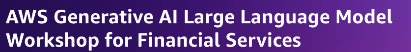

This repo contains the code for the workshop on [Generative AI Large Language Model Workshop for Financial Services](https://catalog.us-east-1.prod.workshops.aws/workshops/c8e0f5d8-0658-4345-8b1d-cc637cbdd671/en-US). The workshop is designed to help you understand how to use leverage SageMaker to train, tune, and deploy Large Language Models.

## Getting started
If running this as part of an AWS hosted event, follow the instructions [here](https://catalog.us-east-1.prod.workshops.aws/workshops/c8e0f5d8-0658-4345-8b1d-cc637cbdd671/en-US/1-introduction/4-workshop-set-up) to setup your environment.

If running this on your own, follow the instructions below to setup your environment.
1. Make sure you have access to a [SageMaker Studio](https://docs.aws.amazon.com/sagemaker/latest/dg/studio.html) environment. You can also use a [SageMaker Notebook Instance](https://docs.aws.amazon.com/sagemaker/latest/dg/studio.html) or any other Jupyter Notebook environment that has programmatic access to AWS resources.
2. Ensure your execution role has the following permissions:

SageMaker

    CreateModel
    CreateEndpointConfig / DeleteEndpointConfig
    CreateEndpoint / DeleteEndpoint
    CreateTrainingJob 

SageMaker Runtime

    InvokeEndpoint

3. Clone this repo to your environment
```
git clone https://github.com/aws-samples/large-model-workshop-financial-services.git
cd large-model-workshop-financial-services
```
4. Navigate to the `lab1` directory and open the `few_shot_learning.ipynb` notebook. Follow the instructions in the notebook to complete the lab.

## Contents
[Lab 1: Few Shot Learning](lab1/README.md) - Introductory example showing how to fine-tune a sentence-transformer model for a classification task.

[Lab 2: Large Language Model Tuning](lab2/README.md) - Shows how to fine-tune a FLAN-T5 model for dialogue summarization.

[Lab 3: Cost Effective Multi-Model Deployments](lab3/README.md) - Shows how to deploy multiple models in a single endpoint to reduce inference costs.

## Security

See [CONTRIBUTING](CONTRIBUTING.md#security-issue-notifications) for more information.

## License
This repo is licensed under the MIT-0 License. See the LICENSE file.
