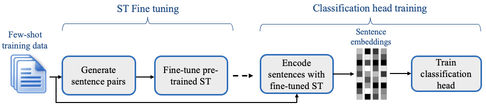
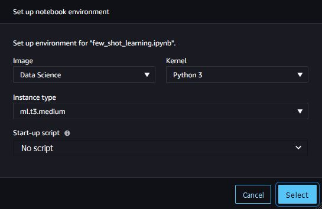
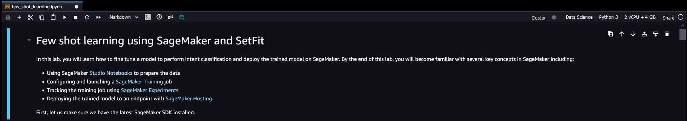

## Introduction
In this Lab, we'll gain a introduction to SageMaker through a practical use case of Few-Shot Learning using a large language model. Specifically, we'll utilize the 🤗 [SetFit](https://github.com/huggingface/setfit) library which implements a few-shot learning [algorithm](https://arxiv.org/abs/2209.11055) of the same name to train a model using [SageMaker Training](https://docs.aws.amazon.com/sagemaker/latest/dg/how-it-works-training.html) and then deploy it to a [SageMaker Endpoint](https://docs.aws.amazon.com/sagemaker/latest/dg/how-it-works-deployment.html) for inference. 

## Background and Use Case
We will use the [Banking 77](https://github.com/PolyAI-LDN/task-specific-datasets/tree/master/banking_data) dataset which classifies customer online banking queries into one of 77 intents. Few examples of the dataset are shown below. 
- What can I do if my card still hasn't arrived after 2 weeks? -> card_arrival
- How do you decide what the exchange rates are? -> exchange_rate
- Please let me know how to change my PIN? -> change_pin

While the dataset contains over 10,000 we will only use a small fraction of it to train the model and still achieve great results. This is enabled by the few-shot learning SetFit algorithm which is able to learn from a small number of examples. The algorithm is illustrated below [source](https://github.com/huggingface/setfit) 

This algorithm works by first generating pairs of matching and non-matching category examples from the training data. It then fine-tunes a SentenceTransformer model on these pairs to distinguish between matching and non-matching examples, similar to a binary classification but using a contrastive loss function such as Cosine Similarity Loss or Triplets Loss. The outcome of this training is that the SentenceTransformer model is able to encode the input text into a vector space where similar examples are close to each other and dissimilar examples are far apart. We can use these encoded values as inputs to train a classifier on top of the SentenceTransformer model which by default is a Logistic Regression model from SciKit Learn.

We will launch a SageMaker Training job to train the model, track the experiment using SageMaker Experiments, and then deploy the trained model to a SageMaker Endpoint for inference.

## Instructions
To get started, make sure to first complete all the [workshop setup](../../1-introduction/4-workshop-set-up) steps. Once you are in the SageMaker Studio root directory, double-click the `lab1` directory to navigate inside then double-click the `few_shot_learning.ipynb` file to open the Lab1 notebook. If prompted to select a Kernel as per the popup below, then select the following options **Image**: Data Science; **Kernel**: Python 3; **Instance Type**: ml.t3.medium

Confirm that your notebook shows the instance and kernel selection that is consistent with the screenshot below. 

You are now ready to run the notebook. The notebook allows you to run code snippets interactively by either clicking the play icon in the toolbar or pressing `Shit+Enter` on your keyboard.  

## Conclusion
In this lab we saw how we can train a model using SageMaker Training and deploy it to a SageMaker Endpoint for inference. We also saw how we can use SageMaker Experiments to track the experiment.

