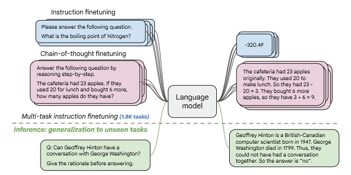

## Introduction
Large language models can be adapted to a wide array of tasks beyond just document classification. These include generation tasks such as text generation, summarization, and translation, and information extraction tasks such as question answering and entity recognition, and many more. In this lab we will fine-tune a large language model on a downstream task of dialogue summarization. We will then deploy the fine-tuned model to a SageMaker Endpoint for inference.

## Background and Use Case
For our dataset, we will use [DialogueSum](https://github.com/cylnlp/dialogsum) which contains over 12K example dialogues along with human generated summaries. The goal of this lab is to fine-tune a model that given a dialogue will automatically generate a summary.

The model that will be used is the FLAN-T5large. The FLAN-T5 is a more powerful variant of the [Text-to-Text Transfer Transformer (T5)](https://arxiv.org/pdf/1910.10683.pdf) model. The improvements primarily stem from fine-tuning the original T5 on 1.8K instruction based tasks where a model not only responds to a prompt but also provides the reasoning behind its response as shown in the diagram below [source](https://arxiv.org/pdf/2210.11416.pdf)

An advantage of a T5 model is that every task is structured as a text-to-text problem. This means that the model can be fine-tuned on a wide variety of tasks by simply providing a prompt and the desired output. For example, the model can be fine-tuned on a dialogue summarization task by prefixing a "summarize:" token to the dialogue as the prompt and the desired summary as the output. This allows you to adapt the fine-tuning code to any task by simply changing the prompt and output.

Fine-tuning large models requires a large amount of compute can take a long time potentially weeks or even months. To complete this lab within reasonable cost and time, we will fine-tune the FLAN-T5large variant that is comprised of 800M parameters on a ml.g5.12xlarge instance which includes 4 NVIDIA Ampere A10 GPUs. The fine-tuning should complete in about 1 hour at a cost of about $7. We will make use of a number of open-source libraries including 🤗 Transformers, 🤗 Accelerate, 🤗 PEFT, and DeepSpeed. These will make the same code adaptable to training much larger models. Even on the single ml.g5.12xlarge instance, you are able to fine-tune models in the range of 20B+ parameters using the aforementioned libraries.

## Instructions
To get started, make sure to first complete configure your environment per the instructions [here](../README.md). Once you are in the SageMaker Studio root directory, double-click the `lab2` directory to navigate inside then double-click the `fine_tune_t5.ipynb` file to open the Lab1 notebook. If prompted to select a Kernel as per the popup below, then select the following options **Image**: Data Science; **Kernel**: Python 3; **Instance Type**: ml.t3.medium

You are now ready to run the notebook. The notebook allows you to run code snippets interactively by either clicking the play icon in the toolbar or pressing `Shit+Enter` on your keyboard.  

## Conclusion
In this lab we saw how we can fine-tune a large language model on a downstream task of dialogue summarization. We also saw how we can deploy the fine-tuned model to a SageMaker Endpoint for inference. In the next lab we will see how we can optimize our inference costs by hosting multiple models on a single endpoint using SageMaker Multi-Model Endpoints(MME)

