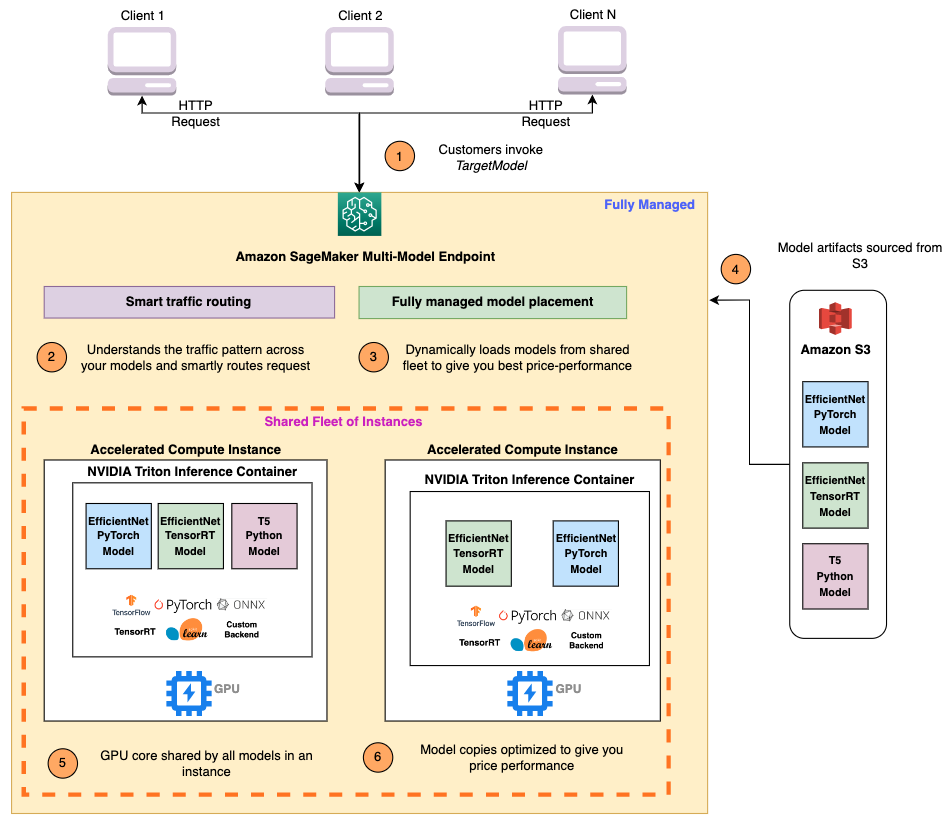

## What is MME?

Amazon SageMaker Multi-Model Endpoints provide a scalable and cost-effective solution to deploy large numbers of models. They use a shared serving container that is enabled to host multiple models. Here are some of the main features provided by MME:

- Host multiple models on a single SageMaker real-time endpoint
- Enables time-sharing of memory resources across models
- Fully managed model placement and smart traffic routing
- Reduce hosting cost by improving endpoint utilization
- Supports GPU and CPU based ML models

## How does it work?

1. SageMaker routes traffic to the right instance behind the endpoint where the target model is loaded. SageMaker takes care of model management behind the endpoint, loads model to the container's memory and unloads the model based on the endpoint's traffic pattern.

2. Dynamically loads models from Amazon Simple Storage Service(S3) to the instance’s storage volume. If the invoked model is not available on instance storage volume, the model is downloaded onto disk. If the instance storage volume reaches capacity, SageMaker deletes any unused models from the storage volume.

3. SageMaker loads the model to NVIDIA Triton container’s memory on a GPU accelerated instance and serves the inference request. If the model is already loaded in the container memory, subsequent requests are served faster, as SageMaker does not need to download and load it again.

4. SageMaker takes care of traffic shaping to the MME endpoint and continues to routes traffics to the instance where the model is loaded. If the instance resources reach capacity due to high utilization, SageMaker unloads the least used models from the container to free up resources for more frequently used models.

5. SageMaker MME can horizontally scale using an auto-scaling policy, provisioning additional GPU compute instances based on metrics such as GPU utilization, memory utilization and others, to serve spiky traffic to MME endpoints.
